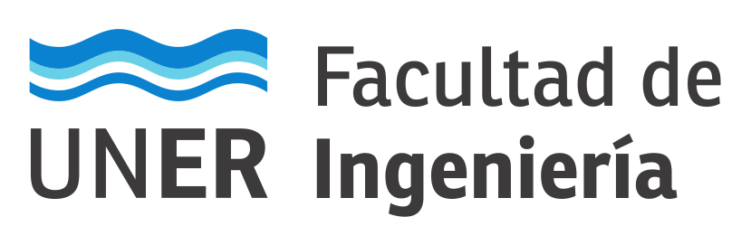

# Cátedra: Electrónica Programable

En este Repositorio se almacena el Firmware que se utilizará de base durante el cursado de la asignatura Electrónica Programable,
correspondiente a la carrera de Bioingeniería de la FIUNER.
El mismo está pensado para ser utilizado con la placa ESP-EDU, una placa diseñada por la cátedra basada en el módulo ESP32-C6-DevKitC-1.

## Primeros pasos

1. [Instalación](./documentación/instalación.md)
2. [Compilación](./documentación/compilación.md)
3. [Grabación y Depuración](./documentación/depuración.md)
3. [Proyecto nuevo](./documentación/proyecto_nuevo.md)
4. [Detalles del Hardware](./documentación/hardware.md) 

## Enlaces de Interés

* [Campus Virtual de la Cátedra](http://campus.ingenieria.uner.edu.ar/course/view.php?id=455)
* [IDF API para ESP32-C6](https://docs.espressif.com/projects/esp-idf/en/stable/esp32c6/api-reference/index.html)

## Autores

* Juan Manuel Reta (juan.reta@uner.edu.ar)
* Eduardo Filomena (eduardo.filomena@uner.edu.ar)
* Juan Ignacio Cerrudo (juan.cerrudo@uner.edu.ar)
* Albano Peñalva (albano.penalva@uner.edu.ar)
* Lucía Eletti (lucia.eletti@uner.edu.ar )
* Diego Arévalo (diego.arevalo@uner.edu.ar)
