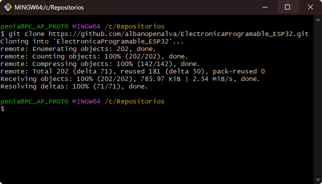
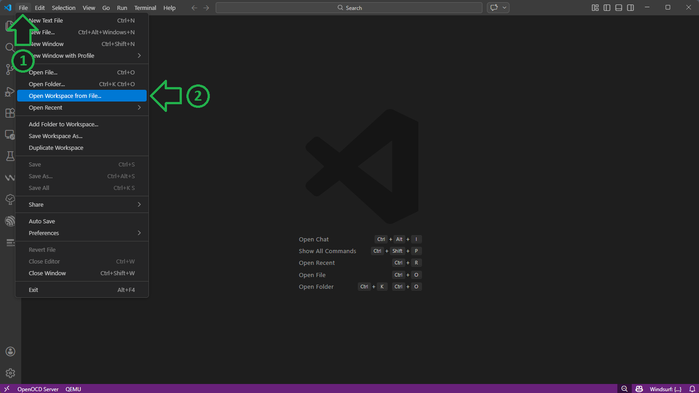
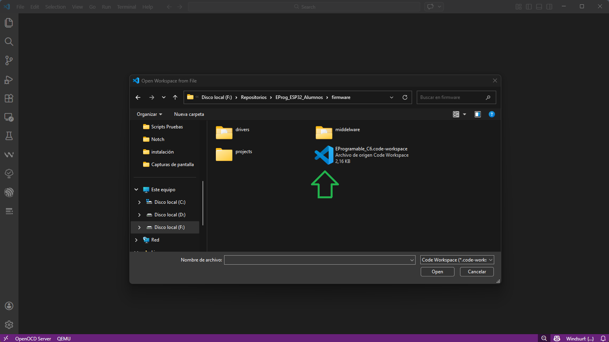
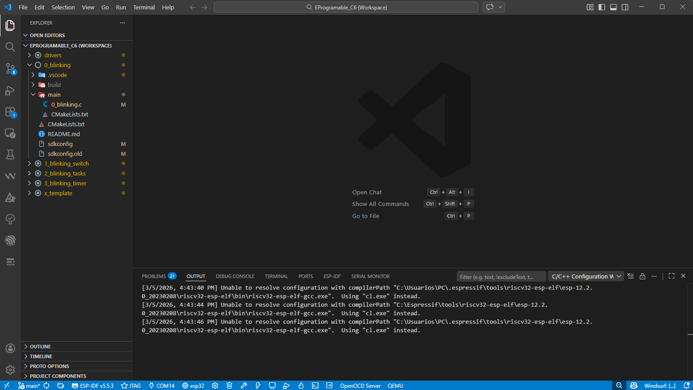
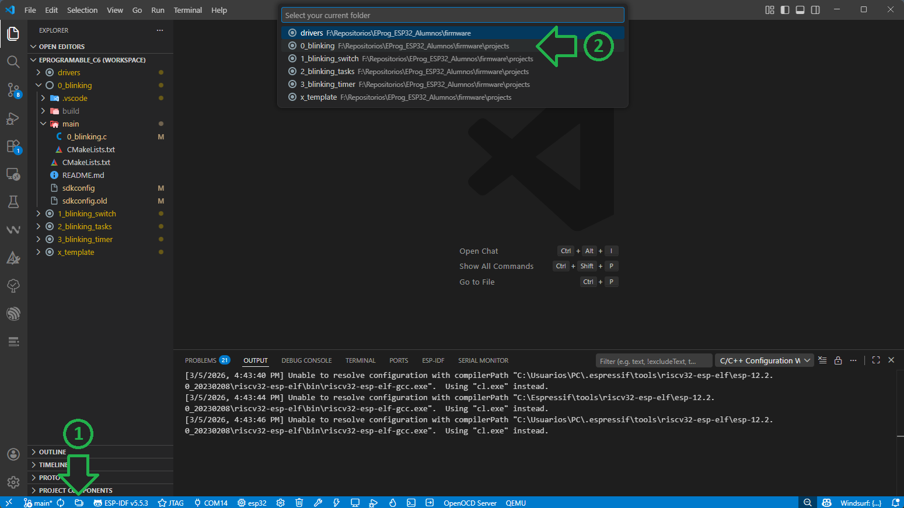
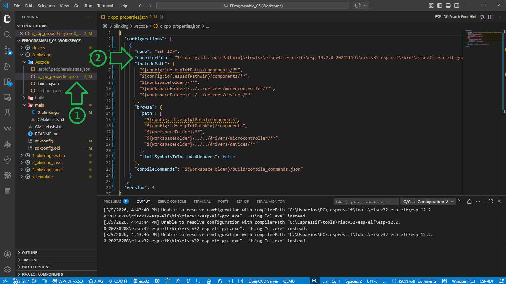
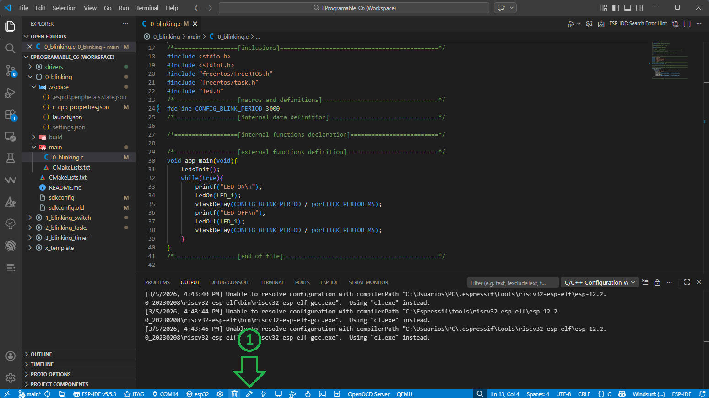
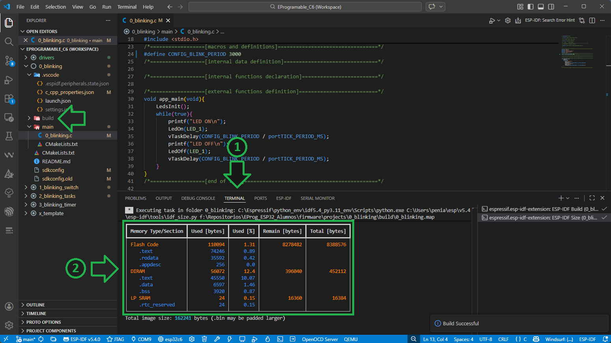

# Compilación 

A continuación se detallan los pasos para la descarga del repositorio de la cátedra y la compilación del primer proyecto de ejemplo. 

1. [Descarga de Repositorio](#Descarga-de-Repositorio)
2. [Configuración del Espacio de Trabajo](#Configuración-del-Espacio-de-Trabajo)
3. [Compilación](#Compilación)

## Descarga de Repositorio

1. Cree una carpeta `Repositorios` en su disco `C:/`.

2. Ejecute la aplicación *Git Bash* y navegue hasta la carpeta creada.
    
> [!TIP]
> También puede pararse sobre la carpeta en el explorador de archivos, hacer click derecho sobre la misma y elegir la opción `Open Git Bash here`.

3. Ejecute el siguiente comando: 
    ```
    git clone https://github.com/prototipado/EProgramable_FIUNER.git
    ```

4. A continuación se descargará el Repositorio en la carpeta correspondiente.

    

## Configuración del Espacio de Trabajo

1. En **Visual Studio Code** seleccionar el menú File -> Open Workspace from File...
    

2. Seleccione el archivo `EProgramable_C6` ubicado en `C:/Repositorios/EProgramable_FIUNER/firmware/`.
    

3. Se le mostrará una ventana preguntando si confía en los autores de estos archivos. Seleccione la opción `Yes, I trust the authors`.

4. En la barra del Explorador (izquierda de la ventana) se le mostrará un árbol con la estructura de directorios del Espacio de Trabajo propuesta por la cátedra. Allí encontrará:
    - drivers: carpeta que contiene los drivers del microcontrolador y dispositivos.
    - 0_binking: proyecto de ejemplo.
    - 1_binking_switch: proyecto de ejemplo.
    - x_template: plantilla a partir de la cual crear nuevos proyectos.
   
    

## Compilación

1. Comencemos compilando el primer ejemplo 0_blinking. 
Como tenemos múltiples proyectos en el Espacio de Trabajo, debemos seleccionar siempre sobre cuál estamos trabajando.
Para eso presione el botón  (`ESP-IDF: Current Project`) y luego seleccione `0_blinking`.
    

2. Dentro de la carpeta 0_binking (y en la de todos los proyecto) podrá encontrar:
    - .vscode: carpeta donde se guardan los archivos de configuración del proyecto.
    - main: carpeta dende se encuentra el código fuente del proyecto.
    - CMakelist.txt: archivo de configuración para la construcción del proyecto.
    - REDAME.md: archivo con la descripción del proyecto.
    - sdkconfig: archivo de configuración del software del fabricante.
   
3. Abra el archivo `c_cpp_properties.json` ubicado en `0_blinking/.vscode/` y revise que el directorio mostrado `"compilerPath"` sea correcto. 
Esta es la ubicación del compilador (**riscv32-esp-elf-gcc.exe**), y el valor por defecto `C:\\Usuarios\\PC\\.espressif\\tools\\riscv32-esp-elf\\esp-12.2.0_20230208\\riscv32-esp-elf\\bin\\riscv32-esp-elf-gcc.exe` puede no coincidir con el directorio donde se encuentre en su equipo, 
ya que depende de la versión de IDF instalada y de la unidad donde usted haya elegido realizar la instalación.
Si el directorio mostrado no existe, corrijalo por el valor correcto.

    

> [!TIP] 
> Las ubicaciones más comunes de instalación son `C:/Espressif/tools/...` y `%USERPROFILE%/.espressif/tools/...` en **Windows** y `$HOME/.espressif/tools/...` en **Linux**.
	
> [!NOTE]
> No se preocupe si el programa le muestra una advertencia en el valor de `"compileCommands"`, el mismo desaparecerá luego de la primera compilación.

4. El código fuente del programa lo puede encontrar en `0_blinking/main/0_blinking.c`

> [!NOTE]
> No se preocupe si el programa le muestra un error en el macro `portTICK_PERIOD_MS`, el mismo desaparecerá luego de la primera compilación.

5. Para compilar el proyecto, presione el botón  (`ESP-IDF: Build project`). Aparecerá una notificación de que el proyecto está siendo compilado.

    
	
> [!NOTE]
> La primera compilación de un proyecto puede tomar varios minutos.
	
6. Una vez finalizada la compilación, el programa le mostrará en el terminal el porcentaje de memoria del microcontrolador que ocupará el proyecto.
Además se puede observar en la barra del Explorador que se ha creado una nueva carpeta `0_blinking/build/`, donde se almacenan todos los archivos resultado de la compilación.
    
	
	
---

Una vez finalizada la compilación del proyecto puede continuar con el instructivo de [Grabación y Depuración](./depuración.md).
