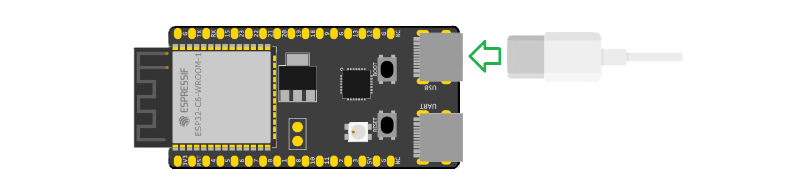
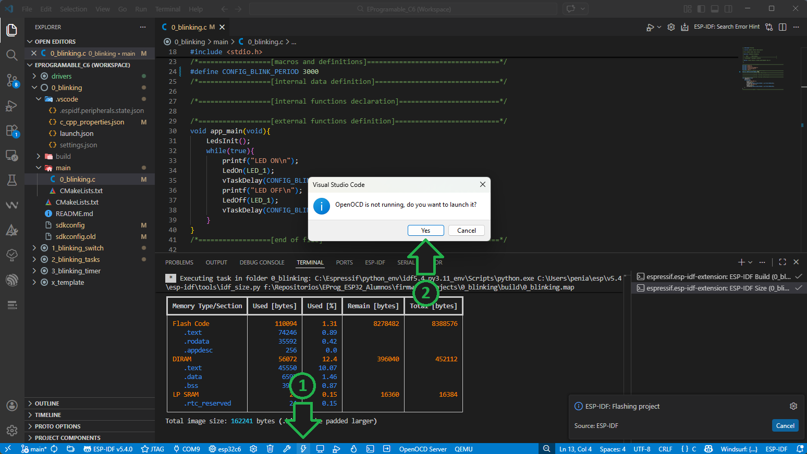
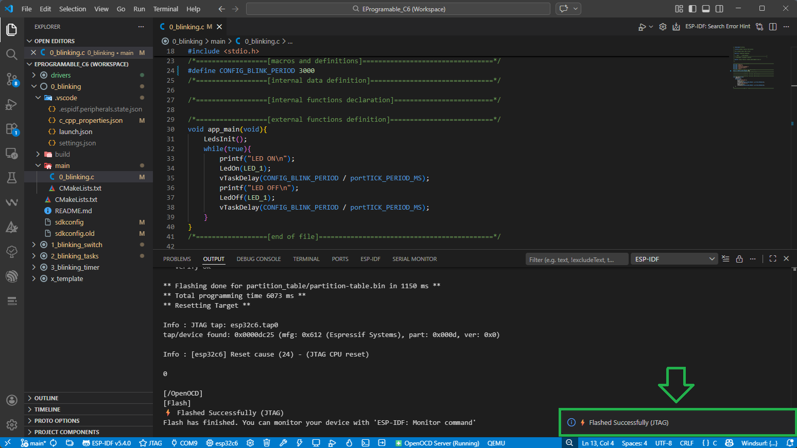
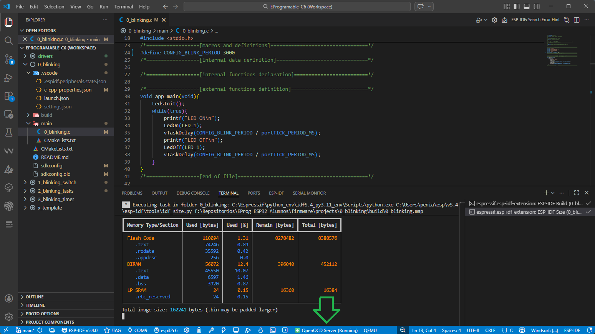
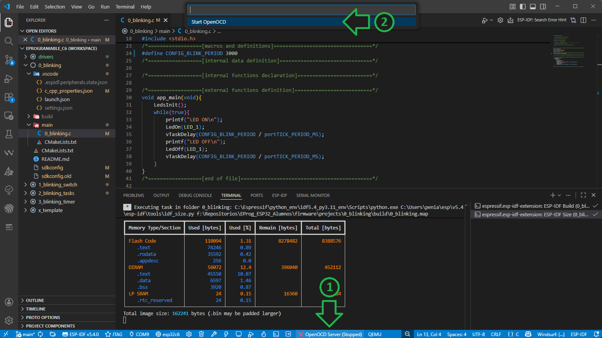
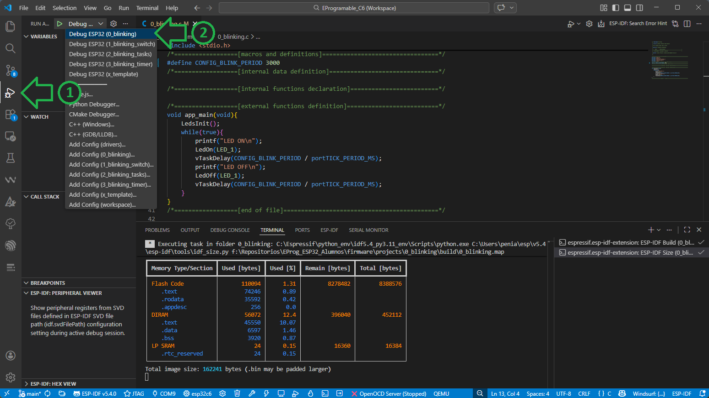
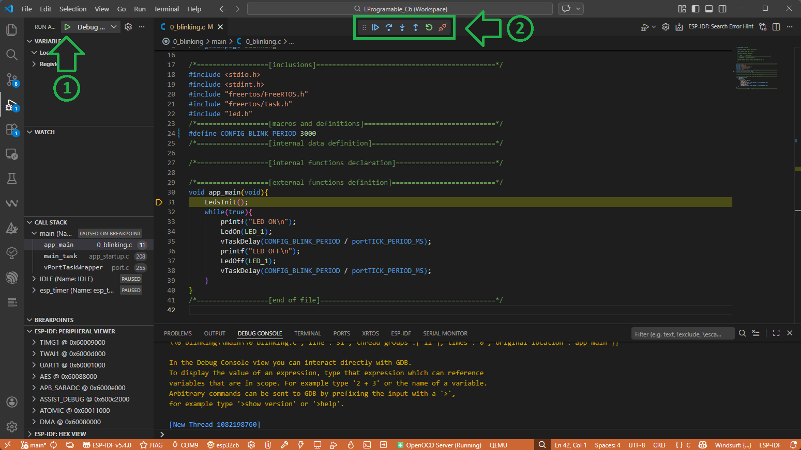
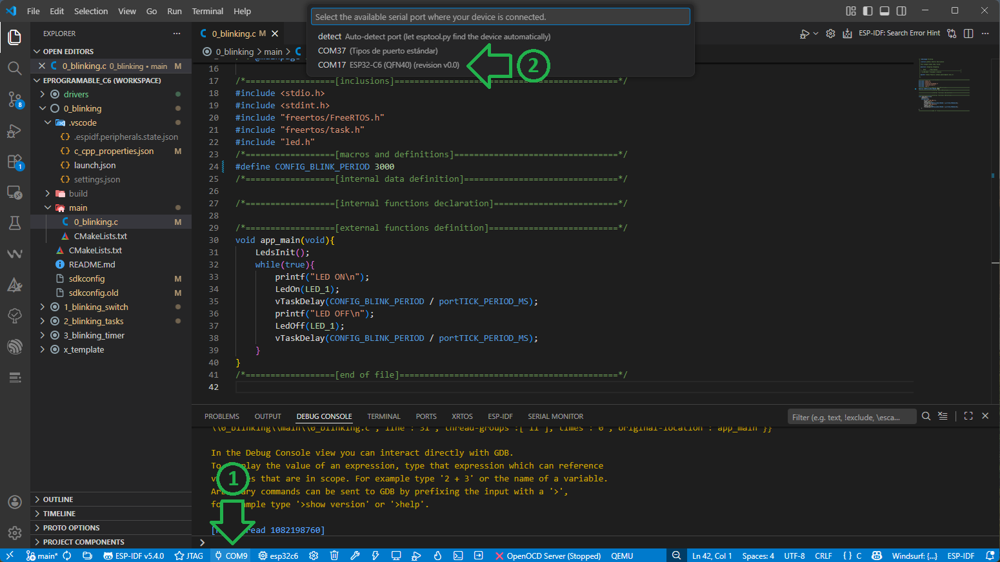
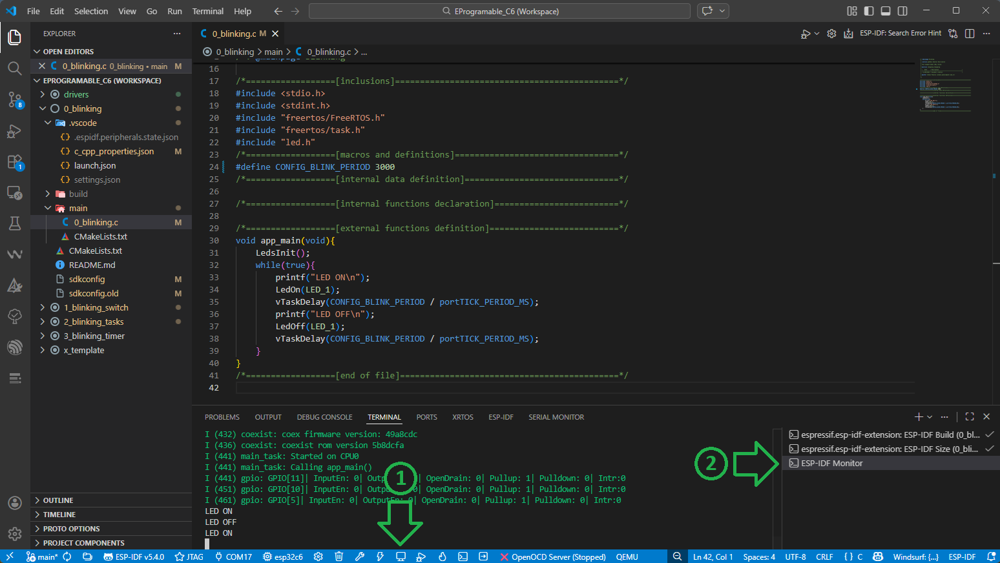
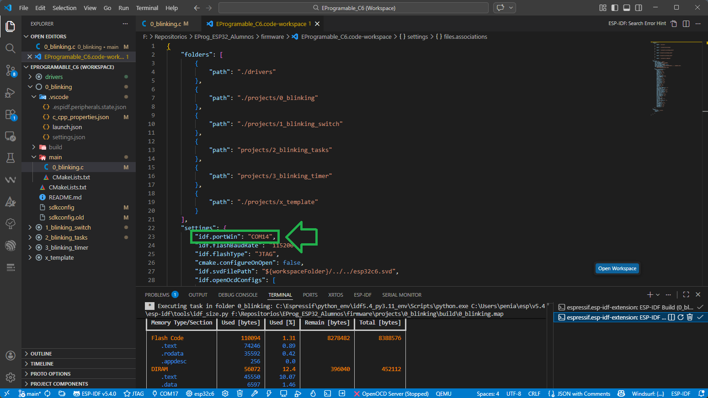

# Grabación y Depuración 

A continuación se detallan los pasos para la grabación de la placa ESP32-C6-DevKitC-1 con un programa compilado, y para el manejo de las herramientas depuración.

1. [Grabación](#Grabación)
2. [Depuración](#Depuración)
3. [Monitor Serie](#Monitor-Serie)

## Grabación

1. Conecte la placa ESP32-C6-DevKitC-1 a su computadora utilizando un cable USB-C en el conector señalado como `USB`.

    
	
2. Presione el botón  (`ESP-IDF: Flash Device`). La primera vez que realice la grabación le aparecerá una ventana prguntando si desea lanzar OpenOCD, presione `Yes`.
 
    
	
3. El programa comenzará con la grabación del microcontrolador. 
Si esta se completa correctamente, podrá observar el mensaje `Flashed Successfully (JTag)` en la pestaña `OUTPUT`.
	
    
	
	Si observa la placa, también podrá observar el parpadeo del LED1.
	
> [!WARNING]
>  Si OpenOCD se encuentra corriendo y usted desconecta el cable USB se le mostrarán múltiples notificaciones de error. Se recomienda siempre detener OpenOCD antes de desconectar el USB. 
> (Click en `❇️ ESP-IDF: OpenOCD Server (Running)` y luego en `Stop OpenOCD`)
	
## Depuración
El modo de Depuración (Debug) nos permite correr el código del programa de manera controlada en el microcontrolador, a la vez que se pueden observar los valores de variables y registros. 
Para entrar en modo Depuración se debe:

1. Asegúrese de que OpenOCD esté corriendo.

    
	
    En caso contrario, inícielo presionando en `❌ ESP-IDF: OpenOCD Server (Stoped)` y luego en `Start OpenOCD`.

    
	
2. Cambie a la vista `Run and Debug` presionando  y luego seleccione en el menú desplegable el proyecto sobre el cual realizar debug (en este caso `ESP32 OpenOCD (0_blinking)`).

    

3. Presione el botón  (`Start Debuging`) o `F5`. Una vez iniciado el modo debug se mostrará una nueva barra con botones para el control de la ejecución del programa.

    
	
> [!WARNING]
> Si OpenOCD se encuentra corriendo y usted desconecta el cable USB se le mostrarán múltiples notificaciones de error. Se recomienda siempre detener OpenOCD antes de desconectar el USB. 
> (Click en `❇️ ESP-IDF: OpenOCD Server (Running)` y luego en `Stop OpenOCD`)
	
## Monitor Serie
El `ESP-IDF Monitor` permite imprimir por pantalla mensajes enviados desde el microcontrolador, que pueden ser de utilidad para la verificación del funcionamiento de un programa.
En el mismo se muestran los mensajes enviados utilizando las funciones `printf()` o `ESP_LOG()`. 

1. Seleccione el puerto `COM` correspondiente a la placa, presionando en `COM14` y luego en el número de puerto correspondiente.

	

> [!TIP]
> El número del puerto `COM` es asignado por su sistema operativo al momento de conectar la placa por primera vez, por lo tanto puede variar de un dispositivo a otro. 
    
2. Presione el botón  (`ESP-IDF: Monitor Device`). Se abrirá un nuevo terminal llamado `ESP-IDF monitor` donde se mostrarán los mensajes enviados.
     
    

> [!IMPORTANT]
> Al ejecutar el `Monitor` el microcontrolador se reinicia, por lo tanto los mensajes mostrados parten desde el inicio de la ejecución del programa grabado.
	
3. También se puede modificar la configuración del puerto COM desde el archivo de configuración del workspace. Esto es útil cuando se va a trabajar durante todo el cursado con una misma PC 
(de modo contrario hay que modificar el puerto COM en cada proyecto). Para esto se debe abrir el archivo `EProgramable_C6.code-workspace` ubicado en `C:/Repositorios/ElectronicaProgramable_ESP32/firmware/`
y modificar la línea `"idf.portWin": "COM14",` colocando el número de puerto COM correspondiente. 

    

Ahora ya puede empezar a trabajar sobre un nuevo proyecto, siguiendo el instructivo [Proyecto Nuevo](./proyecto_nuevo.md).