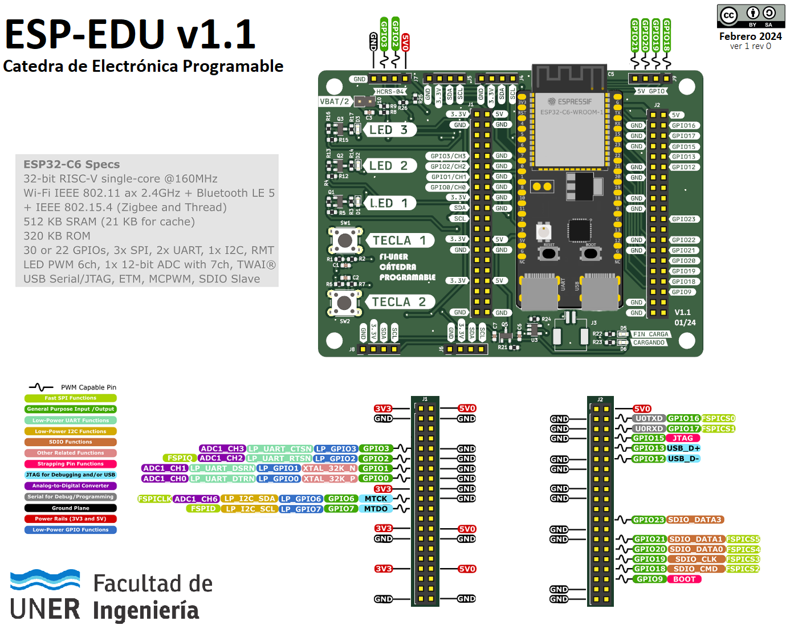

# Hardware

ESP-EDU es una placa diseñada por la catedra de Electrónica Programable para ser utilizada durante el cursado de la materia,
y está basada en el módulo [ESP32-C6-DevKitC-1](https://docs.espressif.com/projects/espressif-esp-dev-kits/en/latest/esp32c6/esp32-c6-devkitc-1/index.html).

## Características

* Procesador: 1 núcleo RISC-V 32-bit (hasta 160MHz)
* RAM: 512kB
* ROM: 320kB
* Flash: 8MB
* Conectividad: Wi-Fi + Bluetooth LE 5 + Zigbee
* 17 GPIOs
* 2 teclas (push-buttons)
* 3 LEDs (rojo, amarillo y verde)
* 1 LED RGB
* 2 UART (0 y 1)
* 1 I2C
* 1 SPI
* 4 entradas analógicas (12 bits)
* 1 salida analógica (8 bits)
* 1 USB - JTAG
* 1 USB - Serie (conectado a UART0)
* 1 cargador de baterías Li-Ion/Li-Po

## Drivers
* **USB**: [FTDI Virtual COM Port Drivers](https://ftdichip.com/drivers/vcp-drivers/)
* **UART**: [CP210x USB to UART Bridge VCP Drivers](https://www.silabs.com/developers/usb-to-uart-bridge-vcp-drivers)

## Enlaces de Interés
* [Manual de Usuario ESP32-C6](https://www.espressif.com/sites/default/files/documentation/esp32-c6_technical_reference_manual_en.pdf)
* [Hoja de Datos de ESP32-C6](https://www.espressif.com/sites/default/files/documentation/esp32-c6_datasheet_en.pdf)
* [Guía de Usuario de ESP32-C6-DevKitC-1](https://docs.espressif.com/projects/espressif-esp-dev-kits/en/latest/esp32c6/esp32-c6-devkitc-1/user_guide.html)
 