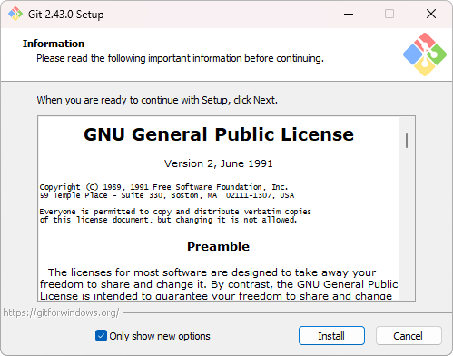
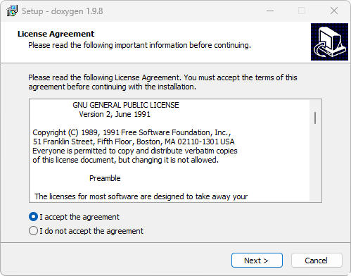
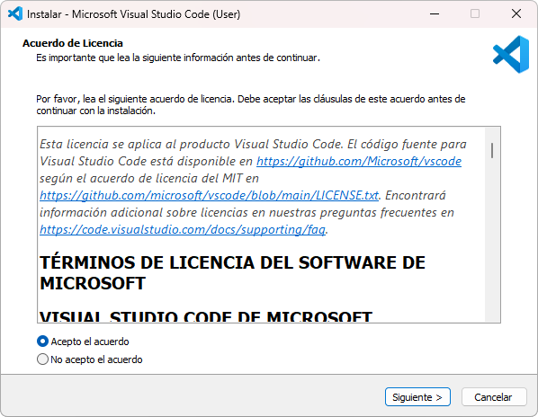
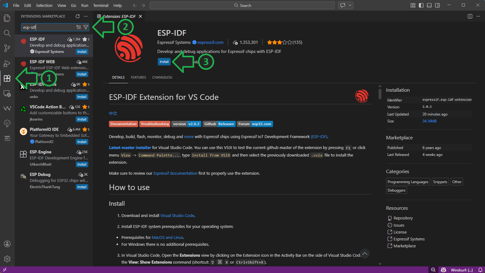
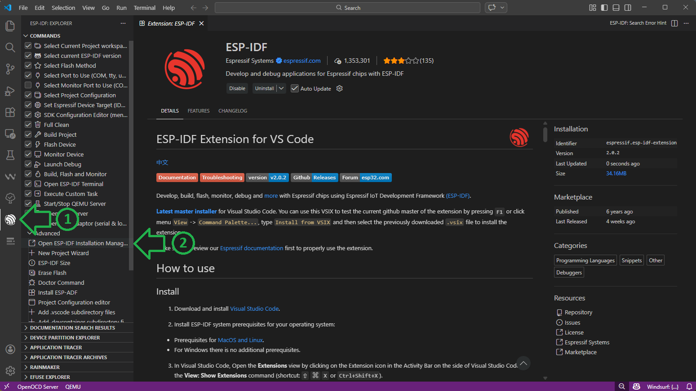
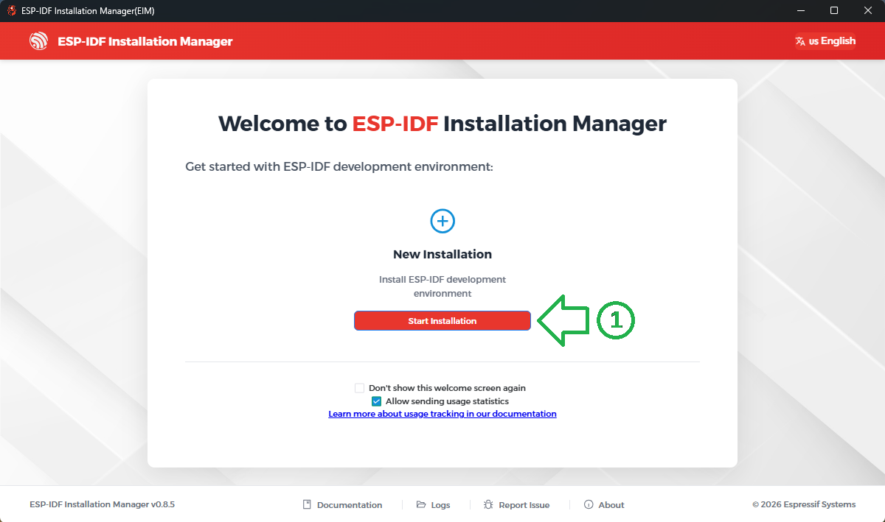
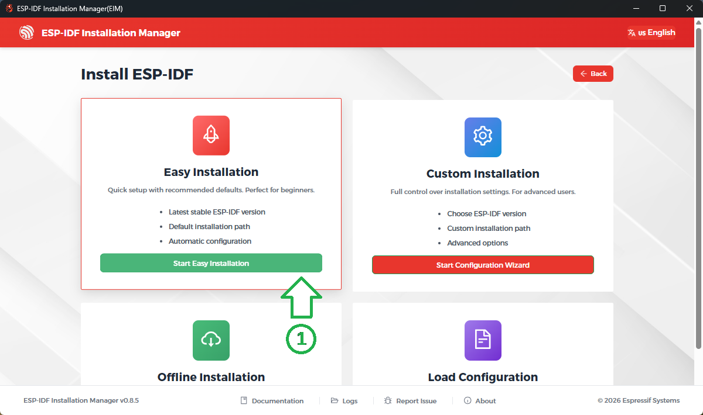
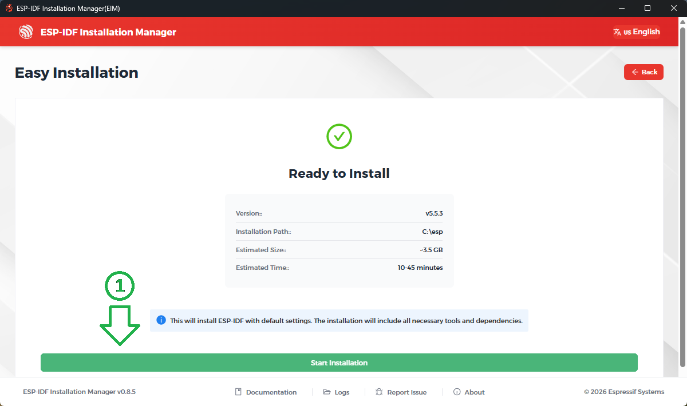
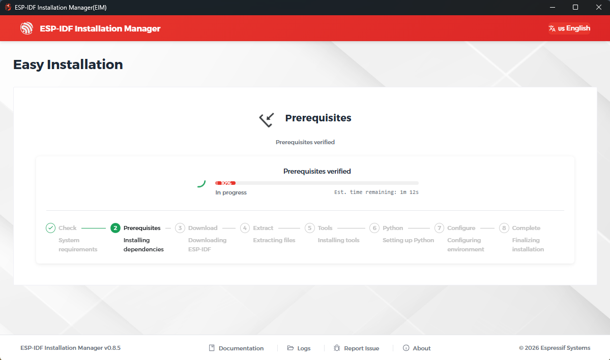
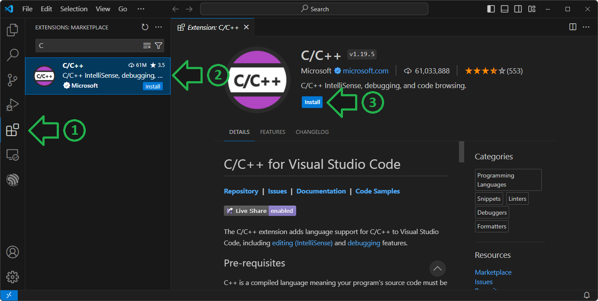

# Instalación 

Para las prácticas de laboratorio se utilizará la placa [ESP-EDU](./documentación/hardware.md) como hardware y el software Visual Studio Code como entorno integrado de desarrollo (IDE de sus siglas en inglés). 
Para que este último sea capaz de programar la placa de desarrollo es necesario descargar componentes de software adicionales. 
Además, es necesario descargar la herramienta Git para trabajar con repositorios como lo haremos en el cursado. 
A continuación se detallan los pasos necesarios para la instalación de estas herramientas:

1. [Git](#Git)
2. [Doxygen](#Doxygen)
3. [Visual Studio Code](#Visual-Studio-Code)
4. [ESP IDF](#ESP-IDF)
5. [C/C++ Extension](#C-C++-Extension)

## Git

Git es un software utilizado para llevar correctamente un registro de cambios en un conjunto de archivos, al mismo tiempo que permite el trabajo colaborativo entre programadores. 
Para la instalación del paquete diríjase a la siguiente [página](https://git-scm.com/downloads) y seleccione la versión correspondiente a su sistema operativo. 
En el caso de ser Windows descargue el instalador “Standalone” para la arquitectura de su ordenador.  
Ejecute el instalador, observará una ventana como en la siguiente figura:



Elija en cada ventana la opción por defecto y luego presione instalar. 
En el caso de utilizar Linux, para la mayoría de las distribuciones basta con correr los siguientes comando en una terminal para instalar el paquete git:
```
sudo apt-get update
sudo apt-get install git
```

## Doxygen

El paquete Doxygen permite automatizar la generación de documentación de código utilizando una serie de comandos reservados dentro de los comentarios. 
Para descargarlo, diríjase al siguiente [link](https://www.doxygen.nl/download.html) en la sección “Sources and binaries”. 
Los paquetes para linux tienen la extensión “tar.gz”, “.dmg” para mac OS y “.exe” para Windows 64 bits. 
A continuación se observa la ventana inicial del instalador para este último sistema operativo. 
Seleccione las opciones por defecto y presione instalar. 



## Visual Studio Code

Visual Studio Code es un IDE y editor de código desarrollado por Microsoft con soporte para múltiples lenguajes de programación.
Para descargarlo ingrese a la siguiete [página](https://code.visualstudio.com/) y elija la versión correspondiente a su sistema operativo.
Al ejecutar el instalador aparecerá la pantalla que se observa en la siguiente figura. Acepte las condiciones e instale seleccionando las opciones por defecto.



## ESP-IDF

ESP-IDF (Espressif IoT Development Framework) es la plataforma oficial de desarrollo de Espressif (el fabricante de la placa a utilizar) para los modulos ESP32.
Para su instalación siga los siguietes pasos:

1. Abra la aplicación Visual Studio Code y diríjase a la vista de Extensiones:  

2. Busque la extensión de ESP-IDF (use palabras clave como `espressif`, `esp-idf`, `esp32`, etc).

3. Presione el botón `Install`.

    

4. Seleccionar el menú "View" -> "Command Palette" y escribir `configure esp-idf`. 

    

5. Elegir la opción `ESP-IDF: Configure ESP-IDF Extension`.

    

6. En el menú siguiente seleccionar la opción `Express`.

    

7. A continuación se le mostrarán las opciones de instalación:
   - Versión: seleccionar `v5.1.2` o superior.
   - Directorio de ESP-IDF: por defecto `%USERPROFILE%\esp`
   - Directorio de ESP-IDF Tools:  por defecto `%USERPROFILE%\.espressif`
   
    Una vez seleccionadas presione el botón `Install`.
    
    

> [!IMPORTANT] 
> Asegúrese que los path de ambas carpetas no contengan `espacio` o la letra `ñ`.

8. La instalación demorará varios minutos. Una vez completada podrá observar un mensaje indicando que todos los ajustes han sido configurados.

    


## C-C++ Extension

La extensión de Microsoft para C y C++ agrega soporte de lenguaje para C/C++ a Visual Studio Code, incluidas funciones de edición y depuración.

1. Abra la aplicación Visual Studio Code y diríjase a la vista de Extensiones:  

2. Busque la extensión de C/C++.

3. Presione el botón `Install`.

    
    
---

Una vez finalizada la instalación de las herramientas puede continuar con el instructivo de [Compilación](./compilación.md).
