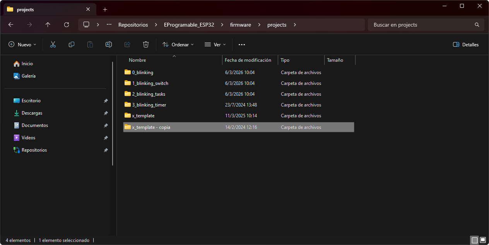
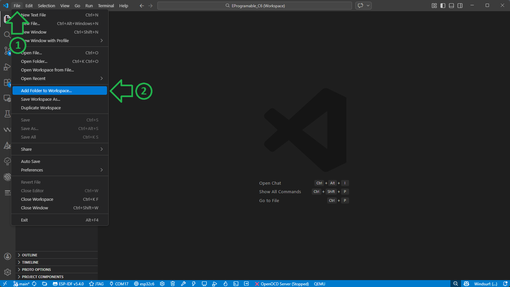
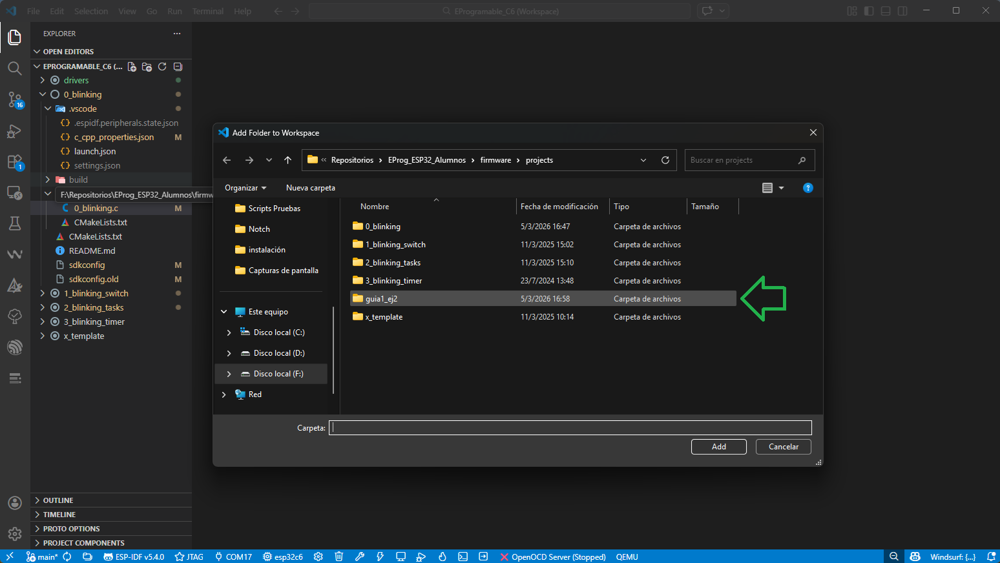
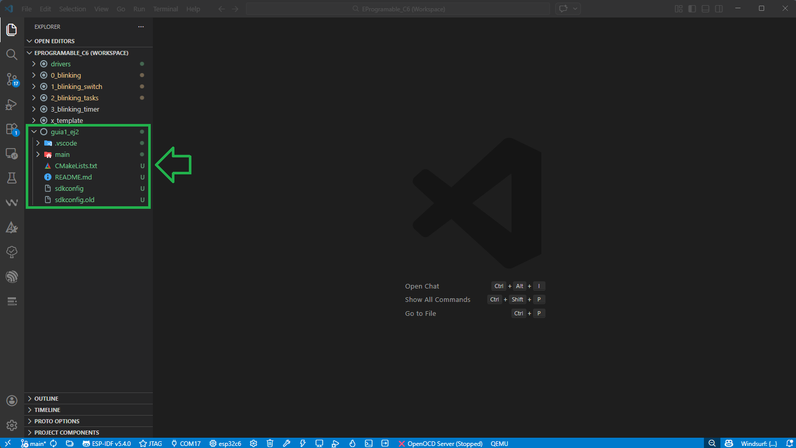
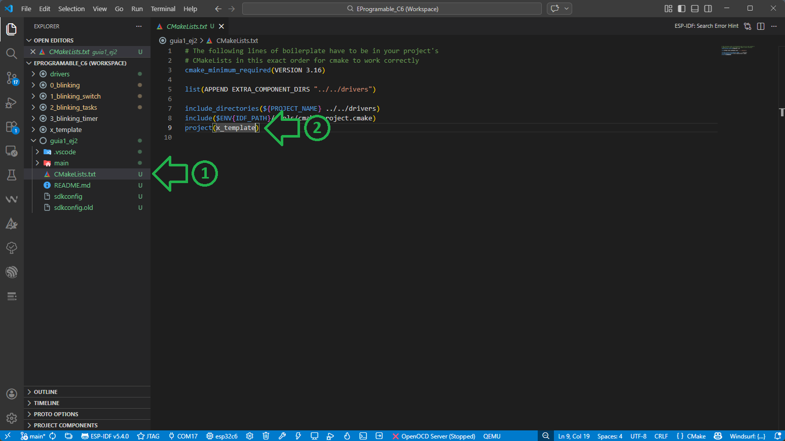
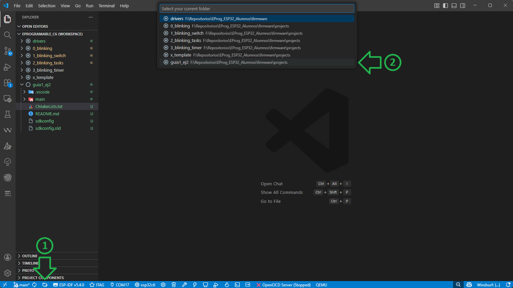
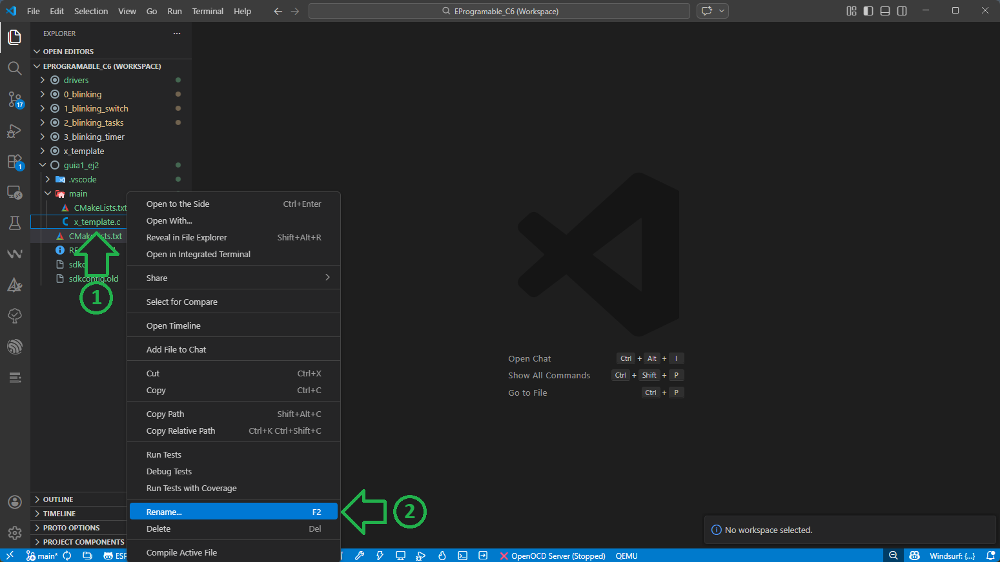
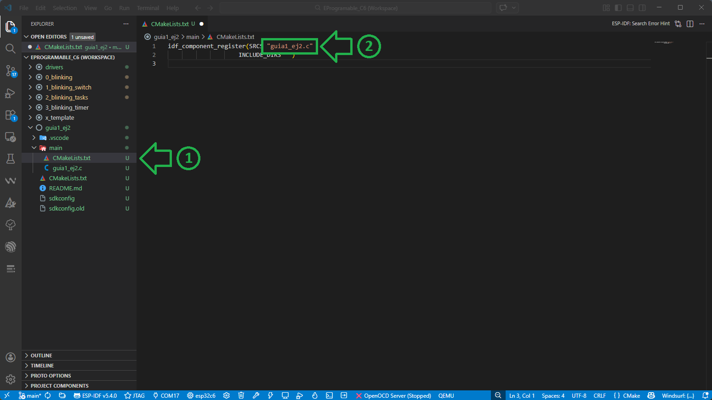

# Proyecto Nuevo 

A continuación se detallan los pasos para crear un nuevo proyecto a partir del proyecto x_template.

## Crear proyecto nuevo

1. Desde su explorador de archivos realice una copia de la carpeta `x_template` (ubicada en `C:/Repositorios/EProgramable_ESP32/firmware/projects/`) 
y renómbrela según el proyecto a realizar (en este ejemplo se reemplazará `x_template - copia` por `guia1_ej2`).

	
	
2. En **Visual Studio Code**, desde el menú `File` seleccione la opción `Add Folder to Workspace`.

	
	
3. Seleccione la carpeta creada.

	
	
4. Se le mostrará una ventana preguntando si confía en los autores de estos archivos. Seleccione la opción `Yes, I trust the authors`.

5. En la barra del Explorador (izquierda de la ventana) se le mostrará el nuevo proyecto agregado.

	
	
6. Abra el archivo `CMakeLists.txt` ubicado en la carpeta `guia1_ej2` y modifique el nombre del proyecto en la línea 9 (en este caso reemplazar `project(x_template)` por `project(guia1_ej2)`).  

	

> [!IMPORTANT]
> No repetir nombres entre proyectos distintos, ya que puede traer problemas a la hora de Depurar (el programa utiliza el nombre del proyecto para nombrar los binarios creados en el proceso de compilación).

7. Para comenzar a trabajar con el mismo, primero debe seleccionarlo como proyecto activo (presione el botón  (`ESP-IDF: Current Project`) y luego seleccione `guia1_ej2`).

	

8. OPCIONAL: También se puede cambiar el nombre del archivo fuente del proyecto (en este caso el archivo `x_template.c`) que se encuentra en la carpeta `main`, haciendo click derecho sobre el nombre del mismo y presionando en `Rename...`. 

	

    ⚠️ **Importante:** Asegúrese que luego de cambiar el nombre del archivo, también se haya actualizado el contenido del `CMakeLists.txt` ubicado en la carpeta `main` con el nuevo nombre elegido. De no ser así, modifíquelo manualmente.

    

> [!NOTE]
> Cada proyecto tiene dos archivos `CMakeLists.txt` distintos: uno en la raiz del proyecto (`./guia1_ej2/CMakeLists.txt`) donde se modifica el nombre del proyecto, y otro dentro de la sub-carpeta `main` (`./guia1_ej2/main/CMakeLists.txt`) donde se modifica el nombre del archivo fuente (`.c`).
