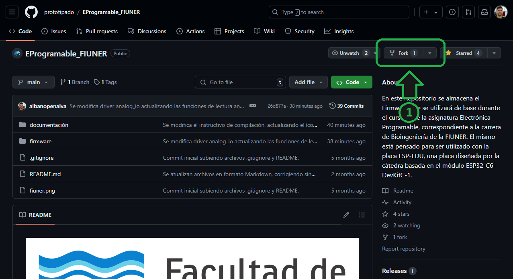
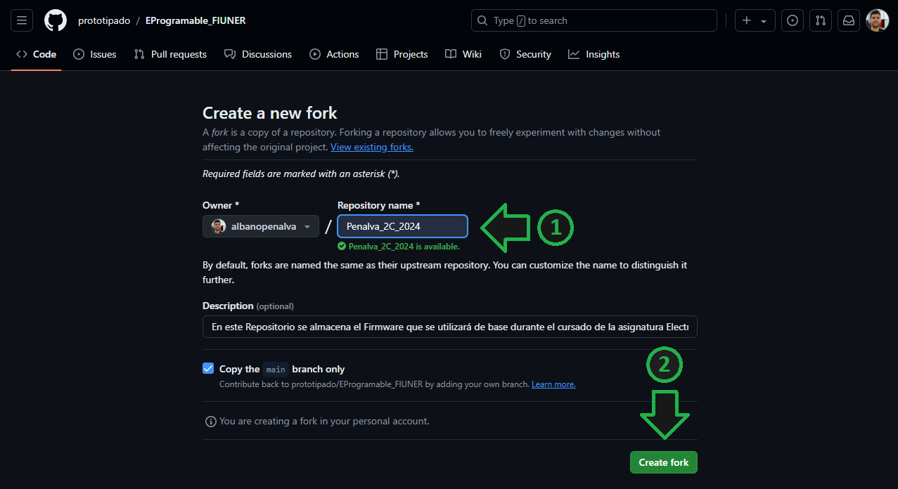
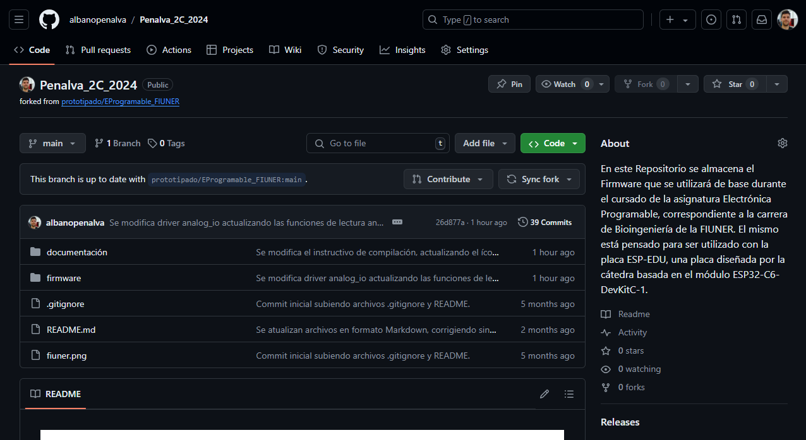
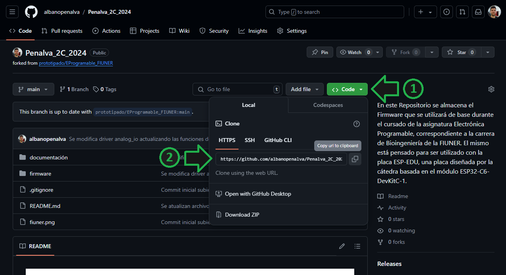
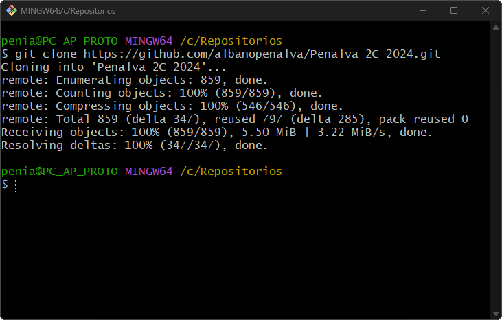

# Creación de Repositorio Personal

A continuación se detallan los pasos para la creación de su repositorio personal a partir del repositorio de la cátedra y la descarga del mismo.

1. [Creación de Repositorio](#creación-de-repositorio)
2. [Descarga de Repositorio](#descarga-de-repositorio)

## Creación de Repositorio

1. Ingrese al sitio de [GitHub](https://github.com) y cree una cuenta (o inicie sesión si ya dispone de una).

    

2. Ingrese al repositorio de la cátedra: [github.com/prototipado/EProgramable_FIUNER](https://github.com/prototipado/EProgramable_FIUNER).

3. Haga click en la opción `Fork`. Esto creará una copia del repositorio de cátedra en su cuenta y le permitará que usted pueda modificarlo.

    

4. Ingrese el nombre de su repositorio como `[Apellido]_[Cuatrimestre]_[Año]`, por ejemplo, `Penalva_2C_2024`. Haga click en `Create fork`.

    

5. A continuación se lo redireccionará a la página principal de su repositorio.

    

## Descarga de Repositorio

1. Cree una carpeta `Repositorios` en su disco `C:/`.

2. Desde la página principal de su Repositorio, haga click en `Code` y copie la dirección del repositorio.

    

3. Ejecute la aplicación previamente instalada *Git Bash* y navegue hasta la carpeta `C:/Repositorios`.

> [!TIP]
> También puede pararse sobre la carpeta en el explorador de archivos, hacer click derecho sobre la misma y elegir la opción `Open Git Bash here`.

4. Ejecute el siguiente comando `git clone` seguido de la dirección de su repositorio. Por ejemplo:

    ```PowerShell
    git clone https://github.com/albanopenalva/Penalva_2C_2024.git
    ```

5. A continuación se descargará el Repositorio en la carpeta correspondiente.

    

---

Una vez finalizada la creación y descarga de su repositorio personal, puede continuar con el instructivo de [Compilación](./compilación.md).
