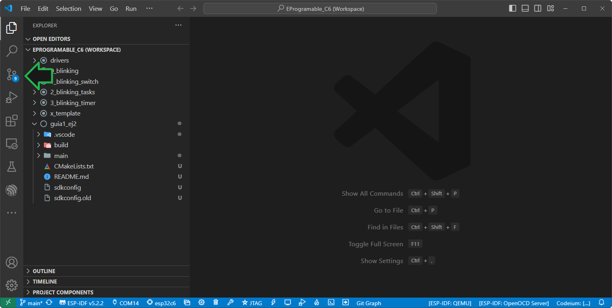
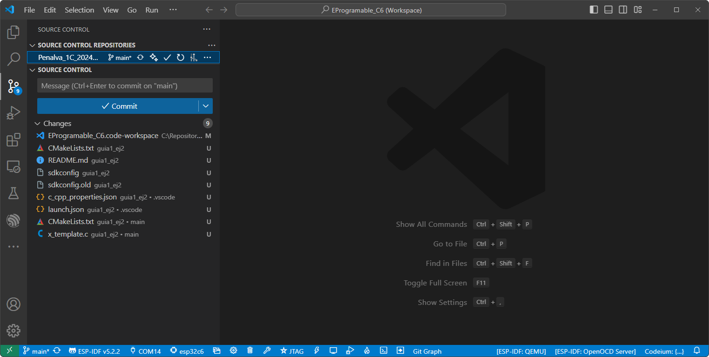
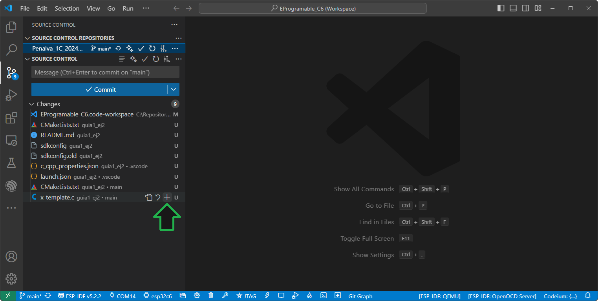
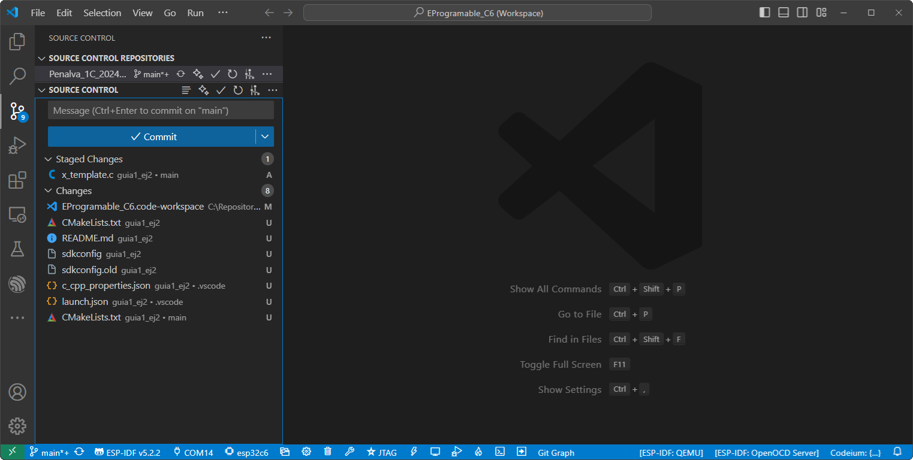
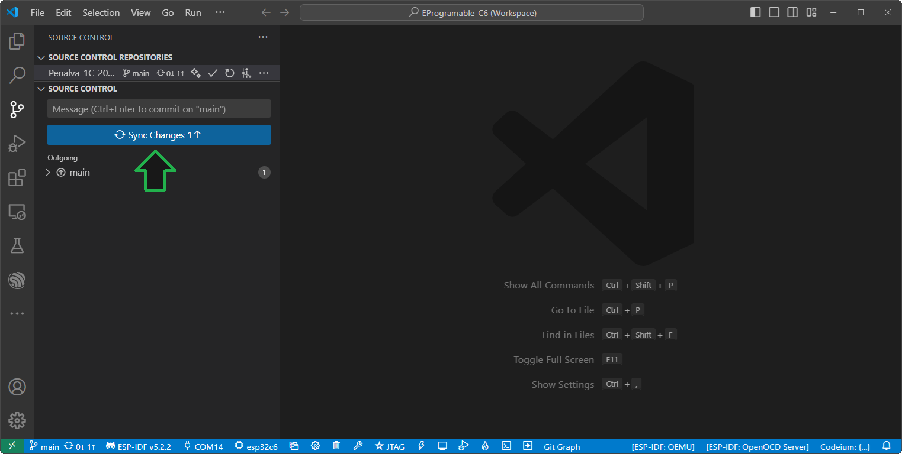
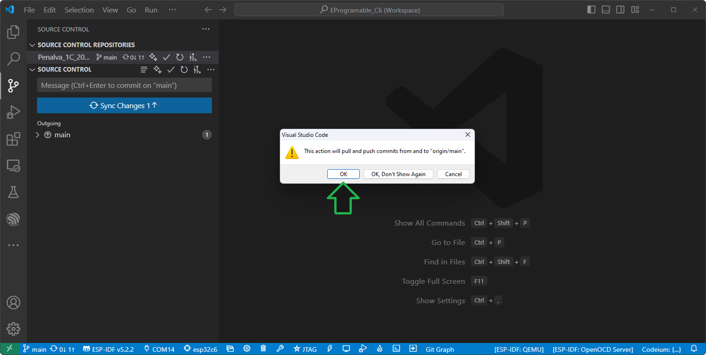
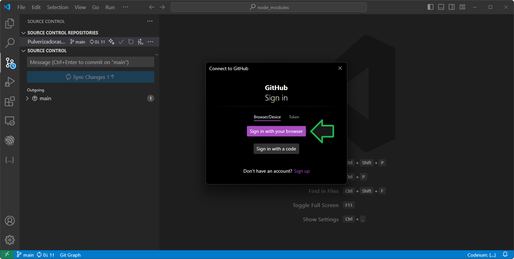
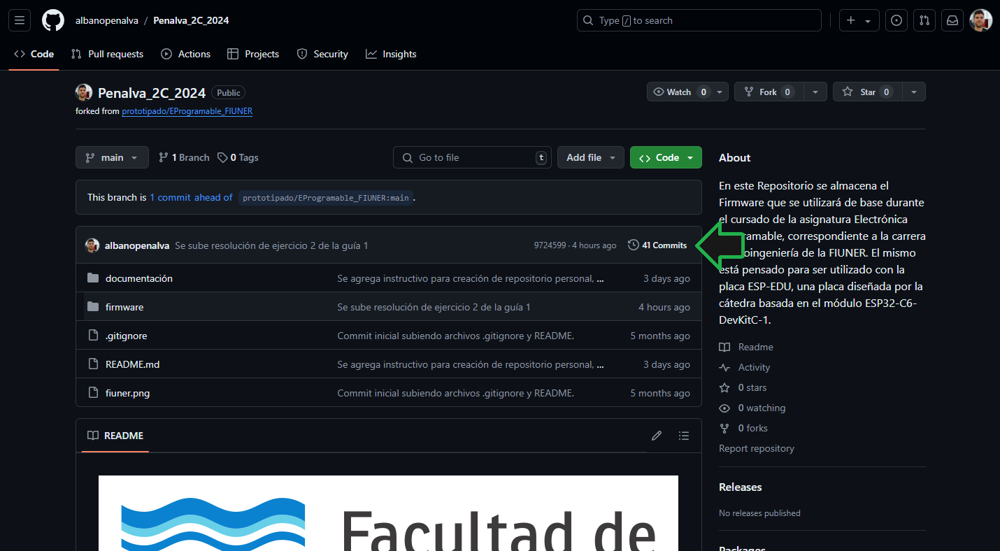
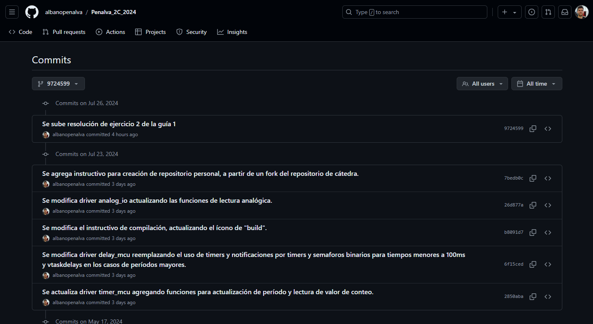

# Actualización de Repositorio Personal

A continuación se detallan los pasos para actualizar los cambios realizados tanto en su repositorio local, como en su repositorio remoto.

1. [Cambios en Repositorio Local](#cambios-en-repositorio-local)
2. [Cambios en Repositorio Remoto](#cambios-en-repositorio-remoto)

## Cambios en Repositorio Local

1. Antes de hacer el primer *commit* es necesario configurar su usuario (el nombre que irá asociado a cada *commit*). Ejecute la aplicación previamente instalada *Git Bash* e ingrese los siguientes comandos (modificando su nombre y dirección de coreo):

```bash
git config --global user.name "Albano Peñalva"
git config --global user.email albano.penalva@uner.edu.ar
```

2. En la aplicación Visual Studio Code, diríjase a la vista de Control de Versiones (`Source Control`): 

    

3. En esta nueva vista podrá ver las modificaciones realizadas en el repositorio, tanto archivos midficados (`M`) como archivos nuevos (`U`).

    

> [!NOTE]
> Si solo se muestra un mensaje indicando que la carpeta no contiene un reositorio git, haga click en `Initialize Repository`.

4. Para elegir los archivos que se incluiran en el siguiente *commit*, haga click en el ícono `+` que aparece a la derecha de cada archivo.

    

5. Los archivos que se incluiran en el siguiente *commit*, se verán en la vista de `Staged Changes`. En este caso se agregan todos los archivos correspondientes al ejercicio 2 de la guía 1.

    

> [!TIP]
> Si por error se agrega un archivo que no corresponde al ejercicio, haga click en el ícono `-` que aparece a la derecha del archivo correpondinte para pasarlo de `Staged Changes` a `Changes`.

> [!IMPORTANT]
> Realice siempre *commits* separados para actualizar cambios que correspondan a poyectos distintos. Del mismo modo, si se modifican o agregan drivers, actualizarlos en *commits* separados de los proyectos.

6. Agregue el mensaje que acompañará el *commit*, en este caso "Se sube resolución de ejercicio 2 de la guía 1". Haga click en el botón `Commit` para realizar el *commit* correspondiente. De esta manera los cambios quedaran guardados en su repositorio local.

    

> [!IMPORTANT]
> Es importante escribir los mensajes de los *commits* de manera que describan adecuadamente los cambios que se realizaron, para que el histórico del proyecto sea legible y entendible por cualquier persona que participe en el proyecto.

## Cambios en Repositorio Remoto

1. Luego de realizar uno o varios *commits*, es necesario realizar un *push* para sincronizar los cambios en el repositorio remoto. Haga click en el botón `Sync Changes` (o en el ícono  de la barra de estado) para realizar el *push* correspondiente.

    

2. En el mensaje de confirmación haga click en `OK`.

    

3. Si es su primer *push* se le solicitará iniciar su sesión de **GitHub**. Se recomienda usar la opción `Sign in with your browser`.

    

> [!NOTE]
> Los repositorios utilizados serán públicos, por lo tanto cualquier persona con el link podrá ver su contenido y/o descargar su contenido (hacer *pull*). Pero solo el dueño del mismo puede modificarlo (hacer *puch*).

4. Para asegurarse de que los cambios han impactado sobre el repositorio remoto, entre a la página de su repositorio y haga click en `Commits`.

    

5. Podrá observar a continuación el historial de *commits* realizados en el repositorio remoto.

    
